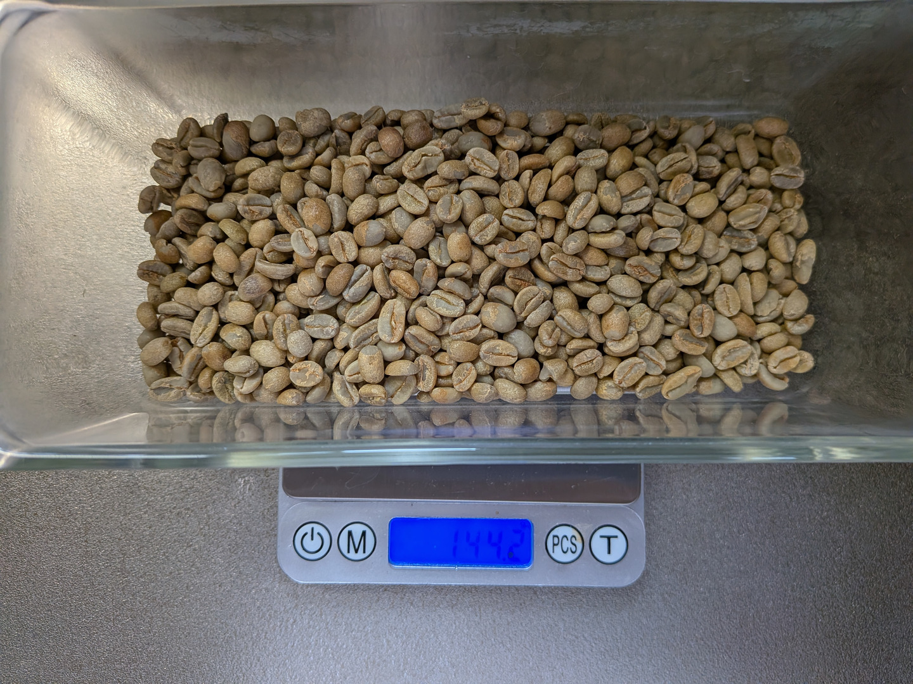
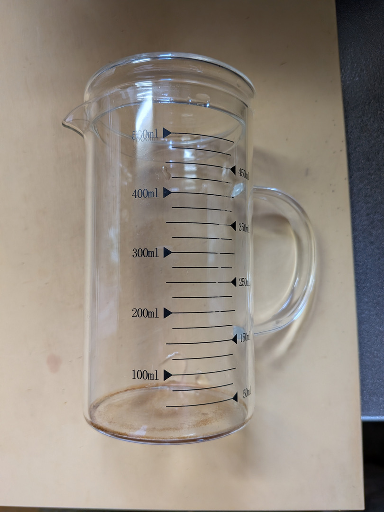
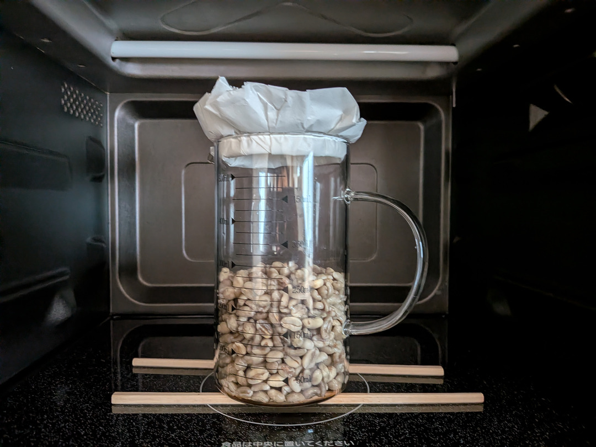

# 準備する器具・材料

本章では、電子レンジのマイクロ波を用いてコーヒー豆を焙煎する際に必要な器具および材料について解説します。

## 必要な器具・材料一覧

1. 電子レンジ
2. コーヒー生豆
3. ホウケイ酸ガラス製耐熱容器（シリンダー型）
4. 木製割り箸（※竹製は不可）
5. 耐熱グローブ
6. 厚手のタオル

---

### 1. 電子レンジ

フラットテーブル型およびターンテーブル型の双方が使用可能です。

ただし、マイクロ波の照射方式が異なるため、焙煎過程における生豆の挙動に違いが生じます。  
本書では、筆者の検証環境である**パナソニック社製フラットテーブル型電子レンジ**を基準として記述しています。

ターンテーブル型を使用する場合も基本的な手順は同様ですが、必要に応じて加熱時間や撹拌タイミングを調整してください。

> **注意**  
> 電子レンジに搭載されているヒーター式の「オーブン機能」ではなく、純粋な「マイクロ波加熱（レンジ機能）」のみを使用します。

---

### 2. コーヒー生豆

一般的な家庭用電子レンジの出力特性上、1回あたりの推奨投入量は**150g前後（最大200g程度）**です。過剰に投入すると加熱ムラが生じやすくなります。

---

### 3. ホウケイ酸ガラス製耐熱容器（シリンダー型）

マイクロ波による焙煎を行うため、容器は以下の条件を満たす必要があります。

* **マイクロ波透過性**: 比誘電率が十分に低いこと（ホウケイ酸ガラスは4.3〜4.8と極めて低損失）。
* **耐熱温度**: 焙煎完了時の豆温度（約230℃）に十分耐えられること（ホウケイ酸ガラスの耐熱温度は450℃〜500℃）。
* **耐熱衝撃性**: 急激な温度変化への耐性（耐熱温度差120℃〜150℃以上）。焙煎時の温度上昇は段階的なため実用上問題ありません。

「マイクロ波を透過すること」「230℃以上の高温に耐えうること」の2点を満たすため、**必ずホウケイ酸ガラス製の耐熱容器**を使用してください。一般的なガラス容器は破損の危険があります。

---

### 4. 耐熱ガラス容器の推奨形状

150g〜200gの生豆が入るホウケイ酸ガラス容器であれば使用可能ですが、本書では**豆の体積変化を目視で観察しながら焙煎進行を制御する手法**をとるため、目盛りの付いたシリンダー形状（メスシリンダー型）の利用を推奨します。

また、焙煎後の容器は200℃以上の高温になるため、安全性の観点から**取っ手付き**の容器が適しています。

---

### 5. 木製割り箸（※竹製は使用不可）

フラットテーブル型電子レンジでは、マイクロ波は庫内底面の中央部に向けて強く照射されます。容器が底面に直接接していると、底部の豆だけが過熱され、庫内底面自体も過度な高温に晒されます。

木製割り箸を台座として敷き、容器を底面から浮かすことで、局所加熱と庫内底面への過熱ダメージを防止できます。

台座にはマイクロ波をほとんど吸収しない（誘電損失率が極めて低い）乾燥した木材を使用します。

> **注意事項**
> * ターンテーブル型電子レンジでは、本台座を設ける必要はありません。
> * 塗料や防腐剤が塗布された割り箸は使用しないでください。
> * **竹製の割り箸は使用できません**。過熱時に油分やヤニが滲み出し、焦げ付きや異臭の原因となります。必ず無塗装の乾燥した木製割り箸を使用してください。

---

### 6. 耐熱グローブ

焙煎中の豆および耐熱ガラス容器は200℃以上の高温に達します。また、容器口部からは100℃近い高温蒸気が噴出します。

焙煎工程では「庫内から容器を取り出し、振って撹拌し、再び庫内に戻す」という作業を高頻度で繰り返すため、火傷を防ぐ耐熱グローブが必須です。作業性を損なわない範囲で、十分な断熱性を持つ手袋を選定してください。

---

### 7. 保護用厚手タオル

耐熱グローブを着用していても、容器上部からの熱気や伝導熱を長時間受け続けるのは危険です。容器を振って撹拌する際は、容器上部に厚手のタオルを当てて蒸気と熱を遮断してください。

