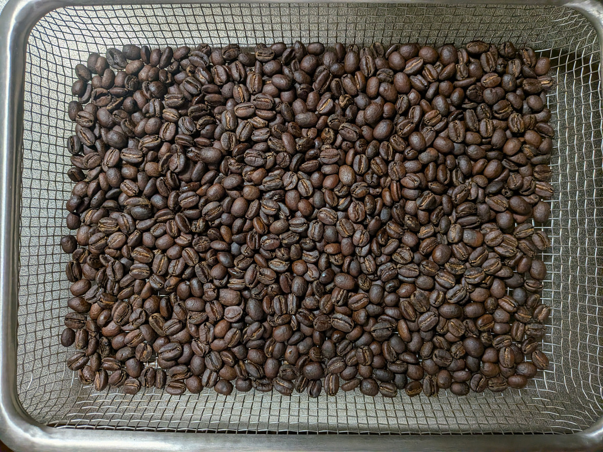

# Microwave Roasting 実践 エチオピア ナチュラル精製

[Microwave Roasting 実践 一般的な説明](./microwave_roasting_practice_ja.md) を
エチオピア ナチュラル精製の生豆の焙煎に適用する。

焙煎日: 2026 August 22nd

## 前提 (step-0)

[Microwave Roasting Principles](./microwave_roasting_principles_ja.md)
の内容を前提とする。

| | |
| ---- | ---- |
| コーヒー生豆 | Ethiopia Sidama Baturo (2024/2025) |
| Cultivar | 74158 |
| process method | Dry Process (Natural) |
| Weight | 144g |

144g としているのは、コーヒー豆一袋 1kg を等分して 150g 前後の重さに調整すると、  
1kg / 7 = 約 143g となるためである。
通常 1kg 袋を購入すると、1007g 程度おまけしてもらえることが多いので  
1回 144g くらいにしておくと、きりよく 1kg 袋を使い切れる、ということである。  

あなたが使用している重量単位がオンスの場合は、適宜 「等分してちょうどよく使い切れる量」で調整してほしい。

生豆を50℃の浄水で洗浄する。
蜂蜜 15g、果糖 20g を溶かした 50℃のお湯で30分間吸水させる。

参考: [Wash Green Beans in Hot Water](./wash_green_beans_ja.md)

| | |
| ---- | ---- |
| 生豆洗浄温度 | 50℃ |
| 蜂蜜 | 15g |
| 果糖 | 20g |
| 吸水後の重量 | 188.3g |

Note:
30分間吸水させた後の重量がどの程度増えるかは、 
豆の種類、水温、季節による作業環境の気温/湿度変化に左右される。

同じ袋から出した豆であっても、前回と今回で一貫しない。  
今回の Ethiopia Baturo は、30分吸水後、 144g -> 183.3g への増加であった。   
前回、同じ豆を焙煎した際は、30分吸水後、144g -> 192.0g への増加であった。   

Ethiopia のコーヒー生豆は、高い標高で育成され、硬い豆が多く、   
中米、南米の低・中標高 (1600m 以下) で育った Washed 精製豆よりは吸水量が少ない傾向がある。  

今回、183.3g と 180g 台前半である、ということは、  
あまり吸水量が多くなかった、という分類になり、  
結果として、焙煎進行 (熱の入り具合)が早くなる可能性が高いことを予測する。  

一方この Shidama Baturo の豆は、経験上、  
1ハゼ開始後、豆の温度が上がりにくい傾向があることが分かっていて、   
したがって、 十分な熱量を加える必要があることも考慮に入れて焙煎を開始する。  

| | |
| ---- | ---- |
| 豆の初期温度 | 30.2℃ | 焙煎開始前に赤外線で計測 |
| 豆の初期体積 | 275ml |
| ガラス焙煎容器を含めた総重量 | 452.3g |

Note: 体積は目視なので、厳密さは求めない。 目安として使う。

## step-1 容器にふたをする

生豆の温度を速やかに上昇・維持しながら焙煎を進行させるために
容器にはふたをする。

## step-2 木製割りばしを台座にしてシリンダーをセット

木製割りばしをレンジ底面に置き、その上に
生豆を入れたホウケイ酸ガラス製シリンダーをセットする。

## step-3 焙煎スタート 低ワットで 100℃ 付近まで

マイクロ波焙煎を開始する。

300W を 1分照射し、30秒撹拌する工程を4セット行う。   
低ワットからスタートするのは、マイクロ波照射による  
加熱ムラを低減するための工夫の1つである。

| No. | ワット | 照射時間 | 撹拌インターバル | 体積 | Note |
| ---- | ---- | ---- | ---- | ---- | ---- | 
| 1 | 300W | 60s| 21s | 275ml | 60s 照射して、レンジから容器を取り出して振って撹拌し、レンジ庫内へ戻すまでに 21s を要したという意味 |
| 2 | 300W | 60s| 23s | 300ml- | `300ml-` は 300ml より少し少ないという意味 |
| 3 | 300W | 60s| 24s | 275ml | |
| 4 | 300W | 60s| 49s | 275ml | 温度を計測するなどしてインターバルが長くなっている |

__Note-1__: この段階ではまだコーヒー豆が十分に濡れているため、  
容器を振って撹拌すると豆の向きが横になったり縦になったりするために  
体積が増えたり減ったりするように見える。ただし、実際に体積が増えたり減ったりしているわけではない。  

**Important Fact 1**: 焙煎開始の初期段階では、含まれる水分の蒸気圧上昇によりコーヒー豆が膨張し、   
結果として体積は**増加**する。　 

| | |
| ---- | ---- |
| No.1 - 4 で加えた総熱量 | 72K Ws (4 * 300W * 60s) |

このタイミングで 焙煎容器を含めた総重量、また外面温度を計測しておく。

| | |
| ---- | ---- |
| ガラス容器外面温度 (赤外線計測) | 容器を含めた総重量 | 
| 91.7℃ | 449.2g |

__Note-2__: `4 * 600W 60s` をかけた後の温度に注意を払う。  
| | |
| ---- | ---- |
| 89℃ 以下 | これから先、熱量を積極的にかける必要がありそうだ、と判断する | 
| 90℃ 前後 | 標準値。 過去の焙煎データから逸脱しない可能性が高い |
| 91℃ 以上 | 熱量が入りやすく、焙煎進行が早い可能性がある。 過焙煎にならないように注意が必要 |
 
今回のエチオピア Natural 精製の豆は  
「熱量が入りやすく、焙煎進行が早い可能性がある。 過焙煎にならないように注意が必要 」  
である。

__Note-3__: 初期重量と `4 * 600W 60s` をかけた後の重量差に注意を払う。   
焙煎開始前に、計測しておいた「容器を含めた総重量」`452.3g` と `72K Ws (4 * 300W * 60s)` を  
加えた後の 「容器を含めた総重量」`449.2g` の差は `3.1g` である。

開始時と、step-3 終了時でどの程度重量が軽くなるか (どの程度水分が蒸発したか) は
豆の状態、外気温などに影響される。  

| 重量差分 | 得られる示唆 |
| ---- | ---- |
| 2.5g 前後 | 標準値。 焙煎総ステップは No.26 - 27 程度で収めるよう努力する | 
| 3g 超 | 熱量が入りやすく、焙煎進行が早い可能性がある。 焙煎総ステップは No.24 程度で収めるよう努力する | 

今回のエチオピア ナチュラル精製の豆は  
「熱量が入りやすく、焙煎進行が早い可能性がある。 焙煎総ステップは No.24 程度で収めるよう努力する」  
と予測し、高ワット (800W) 適用を控えめにするなどの調整に反映する。  

__Note-4__:焙煎工程途中の重量、温度計測は時間を消費し、 
焙煎豆の温度低下を招くため、途中計測のタイミングはここ、step-3 終了時のみとしている。  
次の計測タイミングは、焙煎完了後である。

## step-4 本格加熱開始 高ワット+中ワットを併用する

速やかに温度を上昇させるため、800W (高ワット)を組み入れる。  
しかし 800W を連続照射すると豆が早くに焦げてしまうので  
中ワット (500W、600W) と交互に照射する。

| No. | ワット | 照射時間 | 撹拌インターバル | 体積 | Note |
| ---- | ---- | ---- | ---- | ---- | ---- | 
| 5 | 800W | 30s| 29s | 300ml | 30s 照射して、レンジから容器を取り出して振って撹拌し、レンジ庫内へ戻すまでに 29s を要したという意味 |
| 6 | 500W | 50s| 32s | 300ml | |
| 7 | 800W | 60s| 29s | 275/300ml | `275/300` は、275ml と 300ml の間くらいの体積という意味 |
| 8 | 600W | 60s| 30s | 275ml | |

__Note-5__: No.5 以降、焙煎容器を振って撹拌し、その後 ふたを一瞬 (1秒以下)開けて排気して、すぐにふたを戻す。   
以降、撹拌時にはこのふたを開閉する排気を毎回行う。 ふたは閉じた状態で マイクロ波を照射する。  
ふたを開けたままにしないよう注意する。  

**Important Fact 2**: コーヒー豆の温度が上昇し、水分が蒸発を始めると、結果としてコーヒー豆の体積は**減少**してゆく。
体積減少は、1ハゼ開始まで続く。

| | |
| ---- | ---- | 
| No.5 - 8 区間に加えた熱量| 97k Ws |
| No.1 - 12 の間に加えた総熱量| 169k Ws |

step-4 の終わりか、step-5 の冒頭付近で、早く色づくコーヒー豆が
薄い茶色に色づき始める。 このタイミングで 高ワット (800W) の使用は止める。  
コーヒー豆が早いタイミングで焦げてしまうことを避けるためである。

## step-5 焙煎進行 中ワットで 1ハゼ Ready まで

Ethiopia Natural 精製のコーヒー豆は、熱が入りやすく焙煎進行が急激に進みやすい傾向がある。それを抑えるため、  
また、今回の吸水後の重量が 183.3g 、180g 前半で「吸水量はそう多くない」  
(よって焙煎進行が早い可能性がある)という事実を考慮し、  
"500W 50s (25000 Ws)" は使わず、`600W 40s` (`24000 Ws`) を選択する。

| No. | ワット | 照射時間 | 撹拌インターバル | 体積 | Note |
| ---- | ---- | ---- | ---- | ---- | ---- | 
| 9 | 600W | 40s| 23s | 275ml | |
| 10 | 600W | 40s| 27s | 250/275ml | コーヒー豆が色づき始める。 少し濃い色のものと薄いものが混在し、まだらの状態になる |
| 11 | 600W | 40s| 29s | 250/275ml | |

さらに 600W 40s 照射を続ける。 色づきがだんだん濃くなってくる。

| No. | ワット | 照射時間 | 撹拌インターバル | 体積 | Note |
| ---- | ---- | ---- | ---- | ---- | ---- | 
| 12 | 600W | 40s| 26s | 250ml+ | `250ml+` は 250ml より少し多いという意味 |
| 13 | 600W | 40s| 24s | 250ml+ | コーヒー豆が一回だけ、プスンとはぜる |
| 14 | 600W | 40s| 31s | 275ml- | `275ml-` は 275ml より少し少ないという意味。 体積増加の**転換点** |

**Important Fact 3**: コーヒー豆の1ハゼ開始の少し前、あるいは 1ハゼが始まるのと同じタイミングで
コーヒー豆の体積変化が増加へ転じる。  
この体積増の「転換点」をとらえることが マイクロ波焙煎の重要なポイントになる。

| | |
| ---- | ---- | 
| No.9 - 14 区間に加えた熱量| 144k Ws |
| No.1 - 14 の間に加えた総熱量| 313k Ws |

## step-6 1ハゼ開始前の一押し (Optional)

このコーヒー豆 (Shidama、Baturo) はこれまで何回か焙煎した経験から、 　
1ハゼが始まると焙煎進行が遅くなる (温度が上がりにくいと推測) 傾向があることがわかっている。  
熱量を補うため、step-7 へ移行する前に、もう一押し、600W 30s を1段入れる。

| No. | ワット | 照射時間 | 撹拌インターバル | 体積 | Note |
| ---- | ---- | ---- | ---- | ---- | ---- | 
| 15 | 600W | 30s| 29s | 275ml+ | `275+ml` は 275ml より少し多いという意味 |

体積増が少しずつ進行し、もう1ハゼが始まる直前だが、しかしまだ始まらない。 これは狙い通りの進行具合である。

| | |
| ---- | ---- | 
| No.15 区間に加えた熱量| 18k Ws |
| No.1 - 15 の間に加えた総熱量| 331k Ws |

## step-7 高ワットの使用でハゼを促進

1ハゼの進行を促進するために、高ワット 800W 20s を入れる。  
連続して 800W を照射すると、焙煎工程が急激に進みすぎるリスクが高くなるので、   
間に 600W 20s を挟み、焙煎時間を延ばし、しっかりと豆に熱量が入るようにする。  

| No. | ワット | 照射時間 | 撹拌インターバル | 体積 | Note |
| ---- | ---- | ---- | ---- | ---- | ---- | 
| 16 | 800W | 20s| 28s | 275ml+ | 音はしない。 まだ1ハゼは始まらない |
| 17 | 600W | 20s| 29s | 275ml+ | 音はしない。 まだ1ハゼは始まらない |
| 18 | 800W | 20s| 32s | 300ml- | 1ハゼ スタート はっきりとした体積増 |
| 19 | 600W | 20s| 29s | 300ml+ | |

ここまでで、強い 1ハゼが起こっていれば、800W 照射はしない。  
もし 1ハゼが弱ければ、もう1回 800W 照射工程を入れる。  

今回の Baturo の焙煎では No.18、19 ではっきりと1ハゼが入ったので  
加熱しすぎを防ぐため、800W 照射はここで止める判断を下した。  

| | |
| ---- | ---- | 
| No.16 - 19 区間に加えた熱量| 56k Ws |
| No.1 - 19 の間に加えた総熱量| 387k Ws |

## step-8 最終段階 いつ焙煎を止めるかを判断する

800W 20s、600W 20s のペア照射は No.18、19 で止めたが、  
しっかり熱量を入れ、1ハゼを確実に完了させたいので  
600W 20s を 1段入れる。

| No. | ワット | 照射時間 | 撹拌インターバル | 体積 | Note |
| ---- | ---- | ---- | ---- | ---- | ---- | 
| 20 | 600W | 20s| 29s | 300/325ml |  |

No.20 で 600W 20s 照射は止め、600W 15s 照射に切り替える。  

| No. | ワット | 照射時間 | 撹拌インターバル | 体積 | Note |
| ---- | ---- | ---- | ---- | ---- | ---- | 
| 21 | 600W | 15s | 24s | 325ml |  |
| 22 | 600W | 15s | 24s | 325ml+ |  |
| 23 | 600W | 15s | 25s | 325ml+ | 2ハゼの予感 |
| 24 | 600W | 15s | 25s | NA | 2ハゼの予感 |

Ethiopia Sidama であれば、2ハゼ前、No.24 程度で止めると  
中浅煎りくらいで、苦くならず、フローラルな香りが残った  
おいしいコーヒーになる。  

ここで焙煎は終了である。  

| | |
| ---- | ---- | 
| No.20-24 区間に加えた熱量| 45k Ws |
| No.1 - 24 の間に加えた総熱量| 432k Ws |

## step-9 焙煎豆を焙煎容器からトレイにあける

焙煎豆を焙煎容器からトレイにあけたら、すぐに温度を計測する。  
豆に風を当て、速やかに豆を冷やし、30℃台になったら重量を計測する。  

| トレイに豆を移した直後の温度| 焙煎終了後の豆総重量 |
| ---- | ---- | 
| 215.0℃ | 119.2g | 

## Stats

| | |
| ---- | ---- | 
| 照射ステップ数 | 24 | 
| No.1-24 のトータル マイクロ波照射時間 | 13:35 |
| 撹拌時間も含めたトータル焙煎時間 | 24:20 |
| 焙煎終了直後の豆温度 | 215.0℃ | 
| 焙煎終了後の豆総重量 | 119.2g |
| 総熱量 |  432k Ws |
| kW/h | 1065.21 KW/h |

重量の遷移は以下の通りであった。

| | | |
| ---- | ---- | ---- | 
| 元々袋から取り出した豆の重量 | 144g | | 
| 30分吸水後の豆の重量 | 183.3g | 吸水後、不良豆 2g を取り除いて、183.3g になった |
| 焙煎後の豆の重量 | 119.2g | 119.2g から不良豆 1.2g を取り除いた。 よって最終的な仕上がりは 118g |

## 考察

24ステップ、最終温度 215℃ (210℃台の真ん中あたり)、総熱量 430K Ws という数値は、  
エチオピアをやや浅煎り寄りに焙煎したケースの典型例と言える。  

1065.21 KW/h と 1000を少し超える KW/h 値、というのは  
「144g のコーヒー豆を 30分吸水させ マイクロ波照射で焙煎するのに必要な熱量」  
として  本質的な数字のようだ。  
どの豆でも、大きくずれず一貫して1000+ KW/h 程度の値になる。  
1100 KW/h を超えると、「加えた熱量がかなり多かった」という評価になるが  
ここまで熱量を加える必要があるケースは多くない。  

