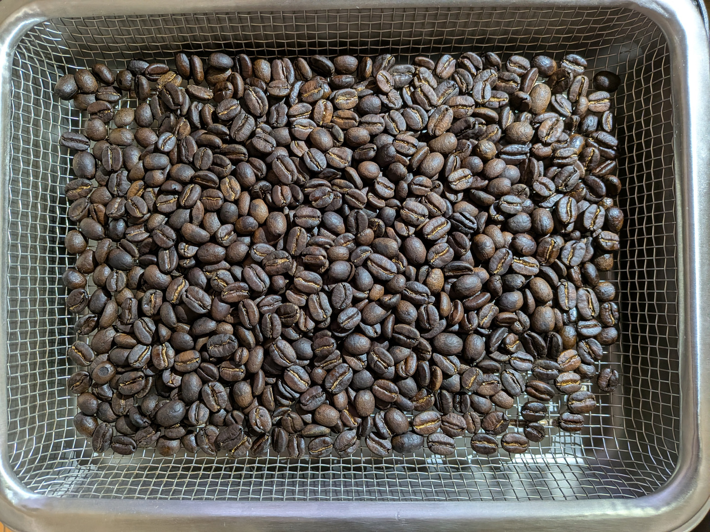

# Microwave Roasting 実践 ベネズエラ ウォッシュド精製

[Microwave Roasting 実践 一般的な説明](./microwave_roasting_practice_ja.md) を
ベネズエラ ウォッシュド精製の生豆の焙煎に適用する。

焙煎日: 2026 August 18th

## 前提 (step-0)

[Microwave Roasting Principles](./microwave_roasting_principles_ja.md)
を前提とする。

| | |
| ---- | ---- |
| コーヒー生豆 | Venezuela Mucucay  (2024/2025) |
| Cultivar | Castillo, Monte Claro, Caturra |
| process method | Fully Washed |
| Weight | 144g |

144g としているのは、コーヒー豆一袋 1kg を等分して
150g 前後の重さに調整すると、1kg / 7 = 約 143g となるためである。  
通常 1kg 袋を購入すると、1007g 程度おまけしてもらえることが多いので   
1回 144g くらいにしておくと、きりよく 1kg 袋を使い切れる、ということである。

あなたが使用している重量単位がオンスの場合は、適宜 「等分してちょうどよく使い切れる量」で調整してほしい。

生豆を50℃の浄水で洗浄する。
蜂蜜 15g、果糖 20g を溶かした 50℃のお湯で30分間吸水させる。

参考: [Wash Green Beans in Hot Water](./wash_green_beans_ja.md)

| | |
| ---- | ---- |
| 生豆洗浄温度 | 50℃ |
| 蜂蜜 | 15g |
| 果糖 | 20g |
| 吸水後の重量 | 190.3g |

Note:
30分間吸水させた後の重量がどの程度増えるかは、 
豆の種類、水温、季節による作業環境の気温/湿度変化に左右される。

同じ袋から出した豆であっても、前回と今回で一貫しない。  
今回の Venezuela Mucucay Caturra は、30分吸水後、 144g -> 190.3g への増加であった。 

Washed 精製のコーヒー生豆は、比較的多く吸水するものが多い。 190g を超えるのは一般的という印象である。

「Washed 精製で、吸水後 190g を超えている」ということから、
比較的しっかりと熱量を加える必要があるという心構えをする。  
また今回は 中深煎り (City Roast) とやや深めに焙煎するつもりなので、
十分に熱量を加えることを心に留めておく。

| | | |
| ---- | ---- | ---- |
| 豆の初期温度 | 28.7℃ | 焙煎開始前に赤外線で計測 |
| 豆の初期体積 | 300/325ml | `300/325ml` は、300ml と 325ml の間くらいという意味 |
| ガラス焙煎容器を含めた総重量 | 459.4g | 460g 近いことから、熱量が必要そう、と予測する |

Note: 体積は目視なので、厳密さは求めない。  目安として使う。

## step-1 容器にふたをする

生豆の温度を速やかに上昇・維持しながら焙煎を進行させるために
容器にはふたをする。

## step-2 木製割りばしを台座にしてシリンダーをセット

木製割りばしをレンジ底面に置き、その上に
生豆を入れたホウケイ酸ガラス製シリンダーをセットする。

## step-3 焙煎スタート 低ワットで 100℃ 付近まで

マイクロ波焙煎を開始する。

300W を 1分照射し、30秒撹拌する工程を4セット行う。   
低ワットからスタートするのは、マイクロ波照射による
加熱ムラを低減するための工夫の1つである。

| No. | ワット | 照射時間 | 撹拌インターバル | 体積 | Note |
| ---- | ---- | ---- | ---- | ---- | ---- | 
| 1 | 300W | 60s| 23s | 325ml | |
| 2 | 300W | 60s| 25s | 325ml | |
| 3 | 300W | 60s| 25s | 325/350ml | `325/350ml` は 325ml と 350ml の間くらいという意味 |
| 4 | 300W | 60s| 52s | NA | 体積を記録し忘れた。 よくあることなので気にしない |

__Note-1__: この段階ではまだコーヒー豆が十分に濡れているため、   
容器を振って撹拌すると豆の向きが横になったり縦になったりするために  
体積が増えたり減ったりするように見える。ただし、実際に体積が増えたり減ったりしているわけではない。

**Important Fact 1**: 焙煎開始の初期段階では、含まれる水分の蒸気圧上昇によりコーヒー豆が膨張し、 
結果として体積は**増加**する。　

| | |
| ---- | ---- |
| No.1 - 4 で加えた総熱量 | 72K Ws (4 * 300W * 60s) |

このタイミングで 焙煎容器を含めた総重量、また外面温度を計測しておく。

| | |
| ---- | ---- |
| ガラス容器外面温度 (赤外線計測) | 容器を含めた総重量 | 
| 90.2℃ | 456.7g |

__Note-2__: `4 * 300W 60s` をかけた後の温度に注意を払う。  
| | |
| ---- | ---- |
| 89℃ 以下 | これから先、熱量を積極的にかける必要がありそうだ、と判断する | 
| 90℃ 前後 | 標準値。 過去の焙煎データから逸脱しない可能性が高い |
| 91℃ 以上 | 熱量が入りやすく、焙煎進行が早い可能性がある。 過焙煎にならないように注意が必要 |

今回の Venezuela Washed 精製の豆は  
「標準値。 過去の焙煎データから逸脱しない可能性が高い」　　
である。

__Note-3__: 初期重量と `4 * 600W 60s` をかけた後の重量差に注意を払う。  
焙煎開始前に、計測しておいた「容器を含めた総重量」`459.4g` と `72K Ws (4 * 300W * 60s)` を  
加えた後の 「容器を含めた総重量」`456.7g` の差は `2.7g` である。

開始時と、step-3 終了時でどの程度重量が軽くなるか (どの程度水分が蒸発したか) は
豆の状態、外気温などに影響される。  

| 重量差分 | 得られる示唆 |
| ---- | ---- |
| 2.5g 前後 | 標準値。 焙煎総ステップは No.26 - 27 程度で収めるよう努力する | 
| 3g 超 | 熱量が入りやすく、焙煎進行が早い可能性がある。 焙煎総ステップは No.24 程度で収めるよう努力する | 

今回は「基準値」に近い数字なので、焙煎進行は遅くもなく早くもなく標準的な動きになりそうだ、 
と予測する。 焙煎総ステップは No.26 - 27 程度で収めるよう努力する。

__Note-4__:焙煎工程途中の重量、温度計測は時間を消費し、   
焙煎豆の温度低下を招くため、途中計測のタイミングはここ、step-3 終了時のみとしている。  
次の計測タイミングは、焙煎完了後である。

## step-4 本格加熱開始 高ワット+中ワットを併用する

速やかに温度を上昇させるため、800W (高ワット)を組み入れる。
しかし 800W を連続照射すると豆が早くに焦げてしまうので
中ワット (500W 50s) と交互に照射する。

| No. | ワット | 照射時間 | 撹拌インターバル | 体積 | Note |
| ---- | ---- | ---- | ---- | ---- | ---- | 
| 5 | 800W | 30s| 35s | 325ml+ | 30s 照射して、レンジから容器を取り出して振って撹拌し、レンジ庫内へ戻すまでに 35s を要したという意味 |
| 6 | 500W | 50s| 30s | 325ml | |
| 7 | 800W | 30s| 29s | 325ml | |
| 8 | 500W | 50s| 32s | 300/325ml | `300/325ml` は 300ml と 325ml の間くらいという意味 |

__Note-5__: No.5 以降、焙煎容器を振って撹拌し、その後 ふたを一瞬 (1秒以下) 開けて排気して、すぐにふたを戻す。  
以降、撹拌時にはこのふたを開閉する排気を毎回行う。 ふたは閉じた状態で マイクロ波を照射する。  
ふたを開けたままにしないよう注意する。

**Important Fact 2**: コーヒー豆の温度が上昇し、水分が蒸発を始めると、結果としてコーヒー豆の体積は**減少**してゆく。
体積減少は、1ハゼ開始の少し前、または開始時まで続く。

| | |
| ---- | ---- | 
| No.5 - 8 区間に加えた熱量| 98k Ws |
| No.1 - 8 の間に加えた総熱量| 170k Ws |

step-4 の終わりか、step-5 の冒頭付近で、早く色づくコーヒー豆が
薄い茶色に色づき始める。 このタイミングで 高ワット (800W) の使用は止める。  
コーヒー豆が早いタイミングで焦げてしまうことを避けるためである。

## step-5 焙煎進行 中ワットで 1ハゼ Ready まで

Washed 精製のコーヒー豆は、Natural 精製の豆と比較して、必要とする熱量が多くなる傾向がある。  
また、今回の吸水後の重量が 190.3g、200g 近くまで達しなかったという意味で、Washed 精製としては標準的と判断する。

| No. | ワット | 照射時間 | 撹拌インターバル | 体積 | Note |
| ---- | ---- | ---- | ---- | ---- | ---- | 
| 9 | 500W | 50s| 30s | 300/325ml | |
| 10 | 500W | 50s| 26s | 300ml | 豆が色づき始める |
| 11 | 500W | 50s| 31s | 300ml- | 多くの豆が色づき始めてまだら模様 |

600W 40s の照射に切り替える。 色づきがだんだん濃くなってくる。

| No. | ワット | 照射時間 | 撹拌インターバル | 体積 | Note |
| ---- | ---- | ---- | ---- | ---- | ---- | 
| 12 | 600W | 40s| 22s | 275ml+ | |
| 13 | 600W | 40s| 28s | 275ml | |
| 14 | 600W | 40s| 28s | 275ml | |

| | |
| ---- | ---- | 
| No.9 - 14 区間に加えた熱量| 147k Ws |
| No.1 - 14 の間に加えた総熱量| 317k Ws |

## step-6 1ハゼ開始まで一押し必要 (Optional)

焙煎中のコーヒー豆の色の変化、体積変化を見る。  
まだコーヒー豆が全体的にしっかりと色づいていない、   
体積が増加に転じるまでにまだ熱量が必要そうだと判断した。  
 
ここで、次は "600W 30s" セットにするか、"600W 40s" セットを選択するかを考える。  
ナチュラル精製であれば "600W 30s" セットを選択するところであるが、   
この焙煎は Washed 精製の豆で、かつ少し深めの焙煎を目指す、という2点を考慮し、   
ここでは "600W 40s" を選択して焙煎を進行させる。

**Important Fact 3**: コーヒー豆の1ハゼ開始の少し前、あるいは 1ハゼが始まるのと同じタイミングで
コーヒー豆の体積変化が増加へ転じる。  
この体積増の「転換点」をとらえることが マイクロ波焙煎の重要なポイントになる。

| No. | ワット | 照射時間 | 撹拌インターバル | 体積 | Note |
| ---- | ---- | ---- | ---- | ---- | ---- | 
| 15 | 600W | 40s| 30s | 275ml |  |
| 16 | 600W | 40s| 26s | 275ml+ | ここで1ハゼスタート。 体積が増加に転じる転換点 |

| | |
| ---- | ---- | 
| No.15 - 16 区間に加えた熱量| 48k Ws |
| No.1 - 16 の間に加えた総熱量| 365k Ws |

## step-7 高ワットの使用でハゼを促進

1ハゼ進行を促進するために、高ワット 800W 20s を入れる。  
連続して 800W を照射すると、焙煎工程が急激に進みすぎるリスクが高くなるので、   
間に 600W 20s を挟み、焙煎時間を延ばし、しっかりと豆に熱量が入るようにする。

| No. | ワット | 照射時間 | 撹拌インターバル | 体積 | Note |
| ---- | ---- | ---- | ---- | ---- | ---- | 
| 17 | 800W | 20s| 29s | 275/300ml | 1ハゼ 弱い |
| 18 | 600W | 20s| 30s | 275/300ml | 音はしない |
| 19 | 800W | 20s| 27s | 275/300ml | 1ハゼ  |
| 20 | 600W | 20s| 30s | 300ml- | 1ハゼ |

まだ 1ハゼの勢いが弱く体積増の割合も鈍い。
よって 800W 20s、600W 20s をもう1セット入れる判断をした。

| No. | ワット | 照射時間 | 撹拌インターバル | 体積 | Note |
| ---- | ---- | ---- | ---- | ---- | ---- | 
| 21 | 800W | 20s| 30s | 300/325ml | 1ハゼ ピーク |
| 22 | 600W | 20s| 32s | 300/325ml | |

| | |
| ---- | ---- | 
| No.17 - 22 区間に加えた熱量| 84k Ws |
| No.1 - 22 の間に加えた総熱量| 449k Ws |

## step-8 最終段階 いつ焙煎を止めるかを判断する

2ハゼまではっきりと入れたい。 

| No. | ワット | 照射時間 | 撹拌インターバル | 体積 | Note |
| ---- | ---- | ---- | ---- | ---- | ---- | 
| 23 | 600W | 15s | 21s | 300/325ml |  |
| 24 | 600W | 15s | 25s | 300/325ml |  |
| 25 | 600W | 15s | 25s | 300- | 2ハゼ |
| 26 | 600W | 15s | 0s | NA | 2ハゼピーク |

あまり2ハゼを進めすぎると苦味が強くなるので
2ハゼがスタートしてピークに達したらそこで焙煎を切り上げる判断を下す。

ここで焙煎は終了である。

| | |
| ---- | ---- | 
| No.23-26 区間に加えた熱量| 36k Ws |
| No.1 - 26 の間に加えた総熱量| 485k Ws |

## step-9 焙煎豆を焙煎容器からトレイにあける

焙煎豆を焙煎容器からトレイにあけたら、すぐに温度を計測する。  
豆に風を当て、速やかに豆を冷やし、30℃台になったら重量を計測する。

| トレイに豆を移した直後の温度| 焙煎終了後の豆総重量 |
| ---- | ---- | 
| 226.9℃ | 110.0g | 

## Stats

| | |
| ---- | ---- | 
| 照射ステップ数 | 26 | 
| No.1-26 のトータル マイクロ波照射時間 | 15:30 |
| 撹拌時間も含めたトータル焙煎時間 | 27:31 |
| 焙煎終了直後の豆温度 | 226.9℃ | 
| 焙煎終了後の豆総重量 | 110.0g |
| 総熱量 |  485k Ws |
| kW/h | 1057.54 kW/h |

重量の遷移は以下の通りであった。

| | | |
| ---- | ---- | ---- | 
| 元々袋から取り出した豆の重量 | 144g | | 
| 30分吸水後の豆の重量 | 190.3g | 吸水後、不良豆 12.0g を取り除いて、190.3g になった |
| 焙煎後の豆の重量 | 110.0g | 110.0g から不良豆 0.8g を取り除いた。 よって最終的な仕上がりは 109.2g |

## 考察

26ステップ、最終温度 226.9℃ (227℃近く)、総熱量 485K Ws という数値、  
2ハゼをはっきり入れた、というところで狙い通りの焙煎度となった。

1057.54 KW/h と 1000を少し超える KW/h 値、というのは  
「144g のコーヒー豆を 30分吸水させ マイクロ波照射で焙煎するのに必要な熱量」
として本質的な数字のようだ。   
どの豆でも、大きくずれず一貫して1000+ KW/h 程度の値になる。  
1100 KW/h を超えると、「加えた熱量がかなり多かった」という評価になるが  
ここまで熱量を加える必要があるケースは多くない。
