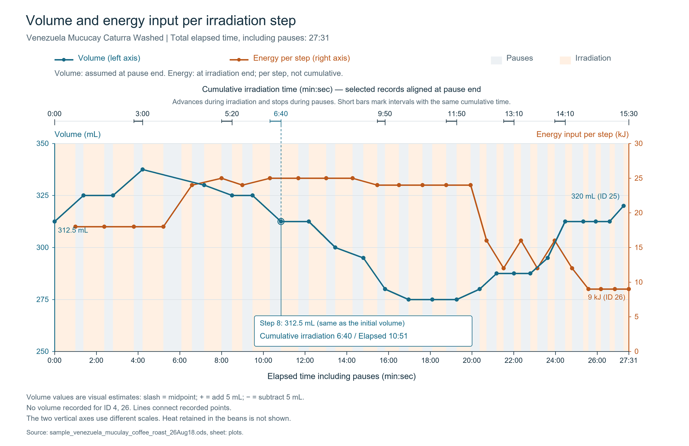

# 焙煎実践事例：ベネズエラ（ウォッシュド精製／中深煎り・シティ）

本書は、[標準プロセス解説](./microwave_roasting_practice_ja.md)に基づき、ベネズエラ産ウォッシュド精製生豆を中深煎り（シティロースト）に仕上げた実証記録です。

* **焙煎実施日**: 2026年8月18日

---

## 焙煎諸元（Step 0）

| 項目 | 設定・実測値 | 備考 |
| :--- | :--- | :--- |
| **生豆銘柄** | Venezuela Mucucay (2024/2025) | - |
| **品種** | Castillo, Monte Claro, Caturra | - |
| **精製方法** | フルウォッシュド（Fully Washed） | - |
| **投入生豆重量** | 144.0g | 1kgロットを約7等分した標準単位 |
| **洗浄水温** | 50℃（浄水） | チャフ・浮き豆除去 |
| **浸漬溶液** | 50℃温水 ＋ 蜂蜜15g ＋ 果糖20g | 30分間浸漬 |
| **吸水後重量** | 190.3g | 不良豆12.0g除去後の実測値 |
| **初期品温** | 28.7℃ | 焙煎開始直前の赤外線計測値 |
| **初期体積** | 300〜325ml | 目盛による目視目安値 |
| **容器込総重量** | 459.4g | - |

> **プロファイル予測**  
> ウォッシュド精製特有の吸水傾向により、浸漬後重量は190.3g（基準上限付近）に達しています。さらに今回は中深煎り（シティロースト）を目標とするため、中盤〜後半にかけて十分な熱量を連続的に供給するプロファイル設計をとります。

---

## 焙煎オペレーション詳細

### Step 1〜2: セットアップ
容器にフタを装着し、電子レンジ底面の木製割り箸上に直立設置します。

### Step 3: 初期昇温（300W均一予熱）

| No. | 設定出力 | 照射時間 | 撹拌インターバル | 体積推移 | 状況・特記事項 |
| :---: | :---: | :---: | :---: | :---: | :--- |
| 1 | 300W | 60秒 | 23秒 | 325ml | 予熱開始 |
| 2 | 300W | 60秒 | 25秒 | 325ml | 安定昇温中 |
| 3 | 300W | 60秒 | 25秒 | 325〜350ml | 水蒸気圧による初期膨張 |
| 4 | 300W | 60秒 | 52秒 | - | 計測のためインターバル延長 |

* **Step 3 投入積算熱量**: 72k Ws（300W × 60s × 4回）
* **Step 4直前 計測値**: 容器外面温度 90.2℃ ／ 容器込総重量 456.7g（重量減少量: 2.7g）
* **判断**: 温度90℃前後、水分蒸発量2.7gと標準的な指標値を示しているため、急激な暴走リスクは低いと判定。全26〜27ステップを想定した標準プロファイルで進行。

---

### Step 4: 本格加熱（高出力＋中出力500W）
吸水量が多いロットに適した「800W＋500W×50s」の交互加熱パターンを採用。撹拌時は毎回フタを一瞬開閉して排気します。

| No. | 設定出力 | 照射時間 | 撹拌インターバル | 体積推移 | 状況・特記事項 |
| :---: | :---: | :---: | :---: | :---: | :--- |
| 5 | 800W | 30秒 | 35秒 | 325ml+ | 急速昇温 |
| 6 | 500W | 50秒 | 30秒 | 325ml | 50秒照射で熱量を蓄積 |
| 7 | 800W | 30秒 | 29秒 | 325ml | 昇温ブースト |
| 8 | 500W | 50秒 | 32秒 | 300〜325ml | 水分蒸発に伴い体積収縮が開始 |

* **Step 4 区間熱量**: 98k Ws ／ **累計熱量**: 170k Ws

---

### Step 5: 定常加熱（中出力によるハゼ準備）
前半は500W×50sで十分な熱量を稼ぎ、後半は600W×40sへ切り替えて均一性を高めます。

| No. | 設定出力 | 照射時間 | 撹拌インターバル | 体積推移 | 状況・特記事項 |
| :---: | :---: | :---: | :---: | :---: | :--- |
| 9 | 500W | 50秒 | 30秒 | 300〜325ml | 水分蒸散継続 |
| 10 | 500W | 50秒 | 26秒 | 300ml | 豆表面の着色開始 |
| 11 | 500W | 50秒 | 31秒 | 300ml- | 黄色〜薄褐色への変化 |
| 12 | 600W | 40秒 | 22秒 | 275ml+ | 600Wへ切替 |
| 13 | 600W | 40秒 | 28秒 | 275ml | 収縮の極大期 |
| 14 | 600W | 40秒 | 28秒 | 275ml | 着色が全体に進行 |

* **Step 5 区間熱量**: 147k Ws ／ **累計熱量**: 317k Ws

---

### Step 6: 1ハゼ突入のための追加熱量投入
色づきと体積の推移から、ハゼ発生にはもう一段の熱量投入が必要と判断し、中浅煎りのような「600W×30s」ではなく「600W×40s」を2セット投入します。

| No. | 設定出力 | 照射時間 | 撹拌インターバル | 体積推移 | 状況・特記事項 |
| :---: | :---: | :---: | :---: | :---: | :--- |
| 15 | 600W | 40秒 | 30秒 | 275ml | 昇温の追い込み |
| 16 | 600W | 40秒 | 26秒 | 275ml+ | **1ハゼ開始（体積反転点）** |

* **Step 6 区間熱量**: 48k Ws ／ **累計熱量**: 365k Ws

---

### Step 7: 1ハゼの促進（800W／600W 交互ブースト）
ハゼの勢いを維持し、豆内部まで確実に熱を通すため、800W×20sと600W×20sを計3セット適用します。

| No. | 設定出力 | 照射時間 | 撹拌インターバル | 体積推移 | 状況・特記事項 |
| :---: | :---: | :---: | :---: | :---: | :--- |
| 17 | 800W | 20秒 | 29秒 | 275〜300ml | 1ハゼ初期（単発音） |
| 18 | 600W | 20秒 | 30秒 | 275〜300ml | 潜熱伝達 |
| 19 | 800W | 20秒 | 27秒 | 275〜300ml | 1ハゼ継続 |
| 20 | 600W | 20秒 | 30秒 | 300ml- | 膨張進行 |
| 21 | 800W | 20秒 | 30秒 | 300〜325ml | **1ハゼのピーク** |
| 22 | 600W | 20秒 | 32秒 | 300〜325ml | 1ハゼ収束へ向かう |

* **Step 7 区間熱量**: 84k Ws ／ **累計熱量**: 449k Ws

---

### Step 8: 仕上げ（2ハゼ突入・煎り止め判定）
中深煎り（シティ〜フルシティ境界）を目指し、2ハゼを明確に捉えます。

| No. | 設定出力 | 照射時間 | 撹拌インターバル | 体積推移 | 状況・特記事項 |
| :---: | :---: | :---: | :---: | :---: | :--- |
| 23 | 600W | 15秒 | 21秒 | 300〜325ml | 1ハゼ完全終了 |
| 24 | 600W | 15秒 | 25秒 | 300〜325ml | 2ハゼ直前の静粛期 |
| 25 | 600W | 15秒 | 25秒 | 300ml- | **2ハゼ開始（細かな破裂音）** |
| 26 | 600W | 15秒 | 0秒 | - | **2ハゼピーク確認・即時終了** |

* **Step 8 区間熱量**: 36k Ws ／ **累計熱量**: 485k Ws

---

### Step 9: 排出・急冷
速やかにトレイへ排出し、品温計測および強制空冷を実施。

* **排出直後豆温度**: **226.9℃**
* **焙煎終了時総重量**: 110.0g（不良豆0.8g除去後: 最終仕上がり **109.2g**）

---

## 実績サマリー

| 評価指標 | 実測値 |
| :--- | :--- |
| **総照射ステップ数** | 26 ステップ |
| **純マイクロ波照射時間** | 15分30秒 |
| **総所要時間（撹拌含む）** | 27分31秒 |
| **排出直後豆温度** | 226.9℃ |
| **仕上がり豆重量** | 110.0g（生豆比 76.4%） |
| **総積算熱量** | 485k Ws |
| **単位時間換算熱量** | 1057.54 kW/h |

---

## 考察

全26ステップ、積算熱量485k Ws、最終温度226.9℃により、2ハゼがしっかりと入った狙いどおりの中深煎り（シティロースト）を実現できました。

吸水量が多く熱量を要するウォッシュド精製であっても、単位時間あたり熱量は1057.54 kW/hと、基準値（約1,060 kW/h）に極めて近い結果が得られました。この数値の再現性は、電子レンジを用いたマイクロ波焙煎における熱量管理の有効性を裏付けています。
