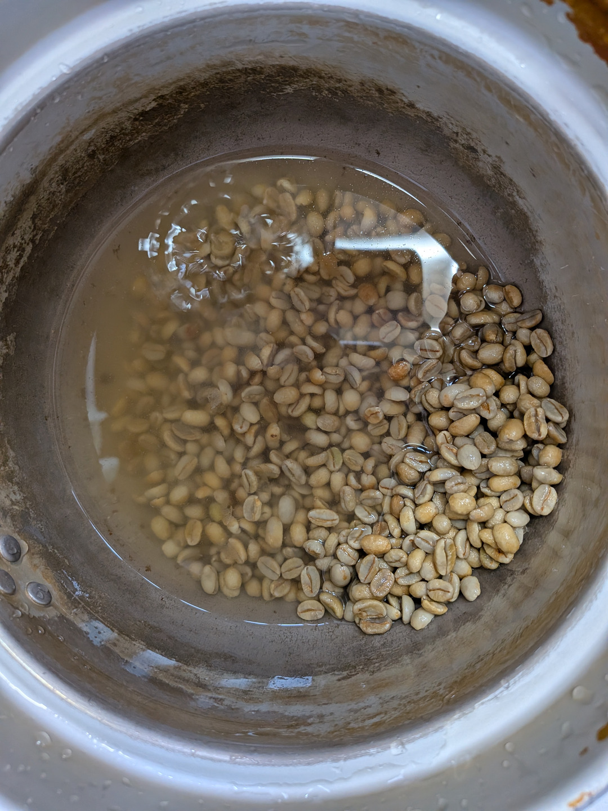
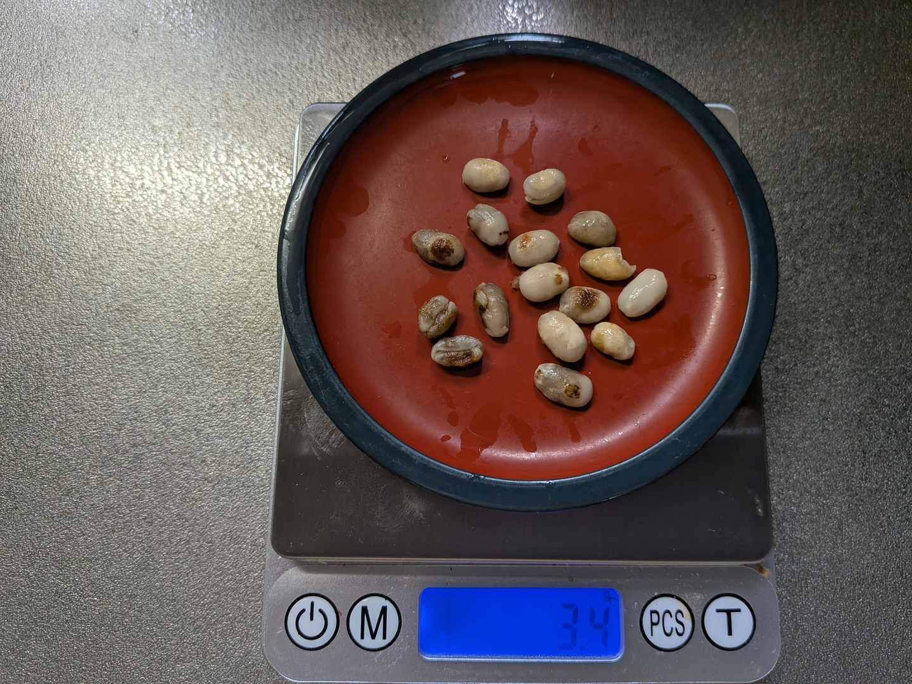
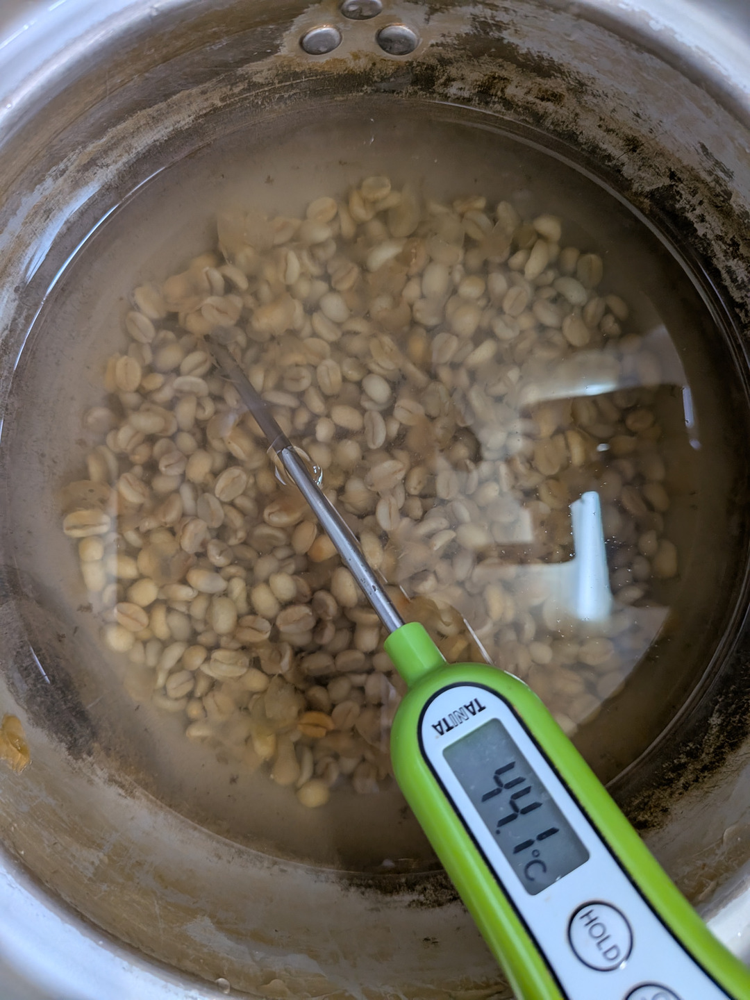
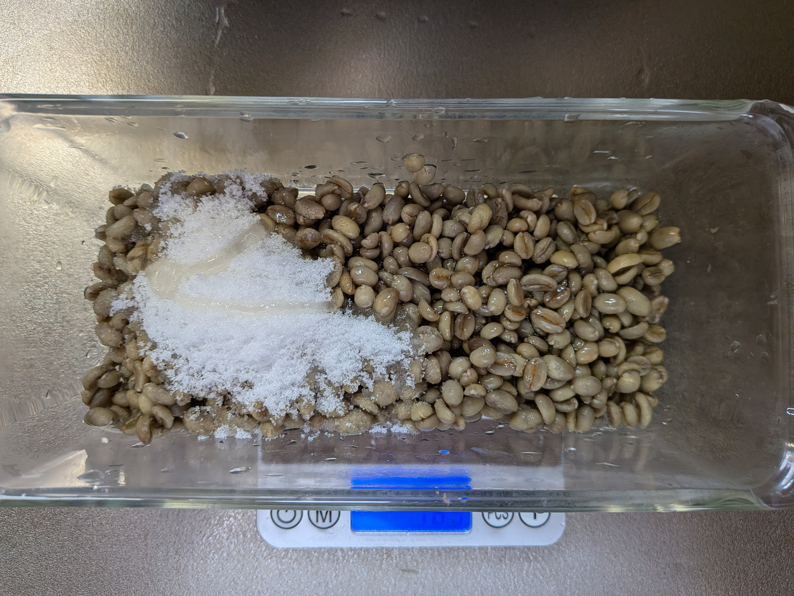
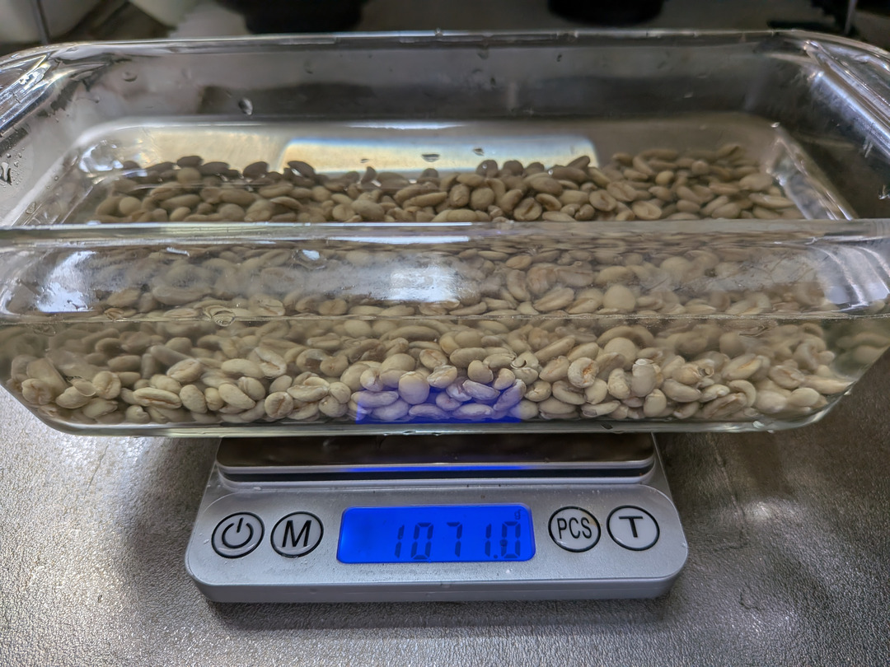
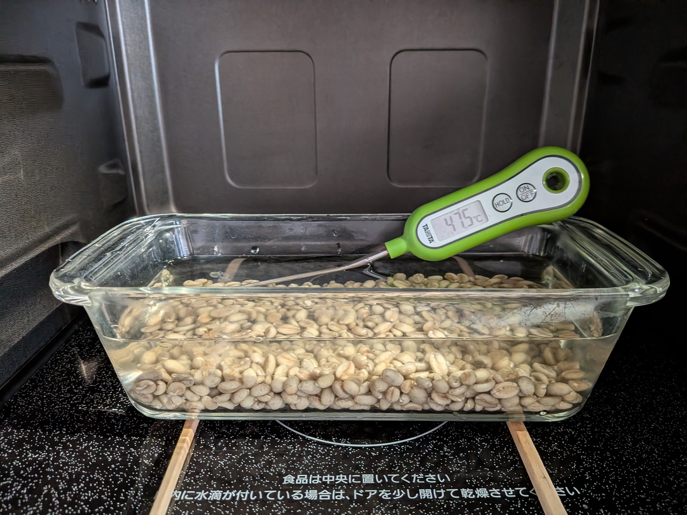
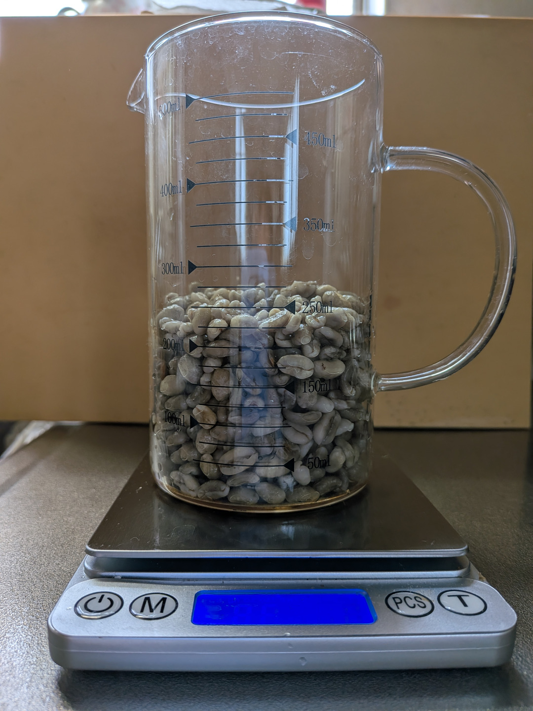
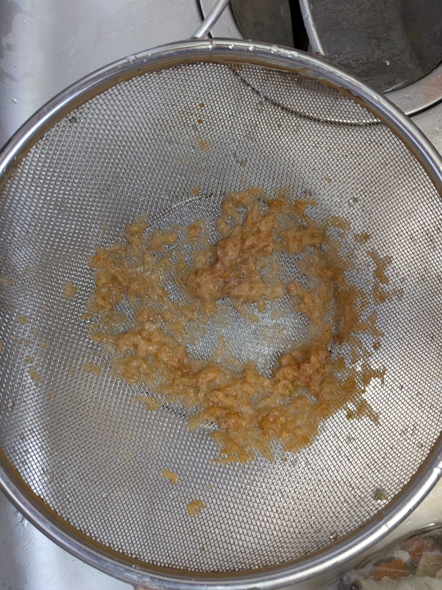
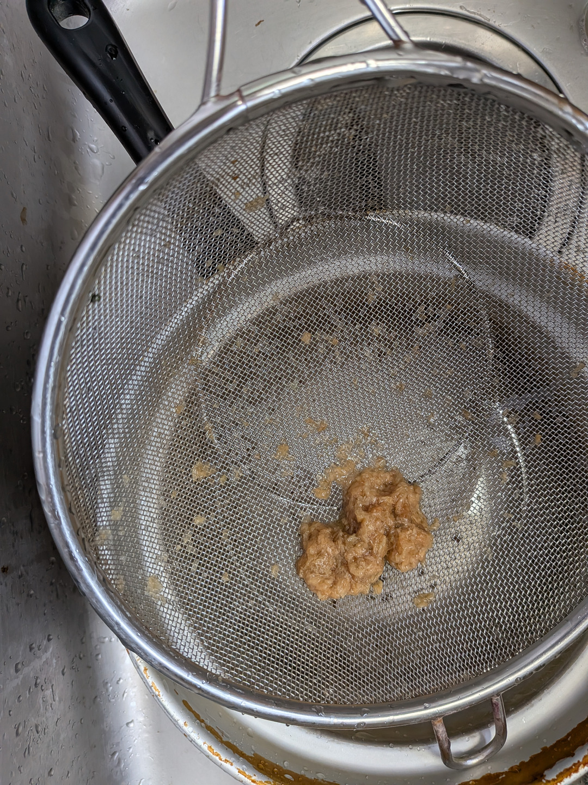
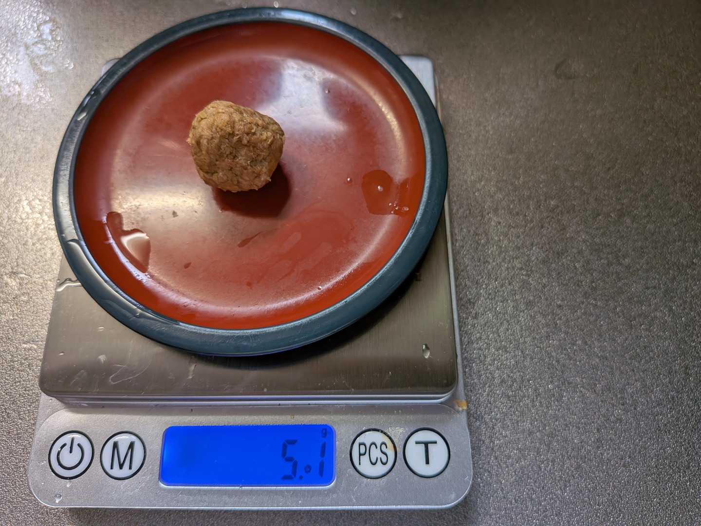

# Wash Coffee Green Beans with Water

コーヒー豆を焙煎する前段階として、
コーヒー豆を水で洗浄する方法を説明する。

コーヒー豆の洗浄は、マイクロ波コーヒー豆焙煎にとって必須ではない。
完全に任意の工程である。  
自身が必要と認めた場合に行えばよい。   

本マニュアルでは常に焙煎前にコーヒー生豆の洗浄を行う。    
提示する焙煎データはすべて洗浄工程を経たものであることに留意されたい。  

## コーヒー豆を洗浄するメリットとデメリット

メリット1: 輸入されたコーヒー生豆は汚れている。洗うことできれいになる。  
  八百屋で買ってきた野菜を調理する前に洗うのと同じことである。  

メリット2: 洗浄することでチャフの大半を取り除くことができる。結果として焙煎が楽になる。  
  また焙煎後の後始末が楽になる。

メリット3: 洗浄する(水に漬ける)ことで、不良豆を見分けやすくなる。    
  水に浮く発育不良の豆、カビが生えた豆など欠陥豆が明らかになりやすい。  

デメリット1: 洗うことで生豆に含まれていた糖分などが流出する。  

デメリット2: コーヒー生豆の洗浄工程が、焙煎後、最終的なコーヒー抽出液の味に影響を及ぼす。  

本マニュアルでは、コーヒー生豆を洗浄することの是非を議論しない。  
これはコーヒー豆を焙煎する各個人の選択の問題である。自ら十分に経験し、自らが決めればよい。  
自分が飲むために焙煎する、コーヒー生豆を洗浄するかしないか、  
自分自身の決定に、権威あるバリスタの意見は必要ない。

## コーヒー豆の洗浄手順

そもそもコーヒー生豆の洗浄を実践している人は多くないはずで、  
広く認められた一般的なコーヒー豆の洗浄手順などというものは存在しない。  

本マニュアルで説明する手順もあくまでマニュアル筆者が実践している
1手法として参考にとどめ、各個人が納得のゆく洗浄手順を導くことが望ましい。  
本マニュアルがその一助になれば幸いである。

### Step-1 Quick Wash

まずさっと水洗いする。 10-20秒程度、水中で回せばよい。
表面についた汚れを落とせればよい。
浄水を使うのが望ましい。

### Step-2: 50℃のお湯洗い

お湯で生豆を十分に洗う。お米を研ぐ要領で、豆同士を軽くこすり合わせ
チャフを落とす。
水に漬けることで明らかになる不良豆を取り除く。

50℃のお湯で洗い、すすいで、もう一度50℃のお湯で洗う。
2回洗うとチャフはほぼ取り除くことができる。  
チャフがほぼ出なくなるまですすぐ。 
チャフが全く出なくなることはないので適宜切り上げる。

### Step-3: 30分 蜂蜜 + 果糖水溶液に漬ける

耐熱ガラスの容器に洗浄が終わった生豆を入れ、
蜂蜜 15g、果糖 20g を加える。

50℃のお湯を、生豆が完全にかぶり、生豆の高さの2倍程度の水位になるまで注ぐ。

発育不足の白い豆が浮いてくるので、ある程度取り除く。
どの程度浮き豆を取り除くかは、その生豆の品質による。

品質が良い豆なら、白く浮いてくる豆は多くない。(吸水した状態で) 5g 以下。  
品質の低い豆だと、大半が浮いてしまう、ということになり、きりがないので
その場合は適切な範囲にとどめる。  
多くても (吸水した状態で) 10g 以下にとどめる。

30分待つ。

### Step-4: リンス

30分経ったら蜂蜜・果糖水溶液を捨て、生豆を水で軽くリンスする。
リンスにより生豆の表面についた蜂蜜・果糖を洗い流しておく。

リンスしたら、焙煎を行う ホウケイ酸ガラス製の容器に生豆を移す。

## 浸水後の重量変化

元々の生豆の重量が144g だったとしたら、
30分の吸水後は、180g - 200g 程度になっている。

どの程度水を吸うかは豆の性質に依存する。
高標高(1900m) で生産された硬いナチュラル精製の豆よりも、
低標高で生産されたウォッシュド精製の豆の方がよく水を吸う。

必要に応じて吸水後の重量が 200g を大きく超えないよう浸水時間を調整する。
200g を超えると電子レンジでのマイクロ波焙煎にかかる時間が延び
作業しづらくなる。

## Appendix-1 豆洗浄によるチャフの除去

生豆の外面についたチャフは、洗浄、30分浸水でほぼ取り除くことができる。

焙煎後の後片付けは格段に楽になる。

また、チャフに発火するといった「火の気」の心配を低減できるのもメリットである。

## Appendix-2 蜂蜜と果糖を使用することの意味

その際に果糖の水溶液に生豆を浸水させる、という考えは

"Enhancing Robusta Coffee aroma by modifying flavour precursors in the greencoffee bean"

という論文から着想を得ている。  
上記のタイトルでインターネット検索をすれば内容を参照できる。  

上述の論文は、Robusta 種を対象としており、また浸水後に条件をそろえるために再び  
水分含有量が 11%程度になるよう再乾燥させるといったプロトコルを使用しているが、  
本焙煎マニュアルは Arabica 種を対象としており、また浸水後 再乾燥させることなくすぐ焙煎工程に入っているので
論文の内容に従っていない。

本マニュアルで果糖は、30分の浸水で抜けてしまう糖類を補おう、という意味合いを持たせている。  
また蜂蜜を追加するのは本マニュアル独自のアレンジであり、 上述の論文は無関係である。  
蜂蜜は、焙煎工程で前駆体の生成に使用される「アミノ酸を追加しよう」程度の意味で
科学的な根拠はない。 

淹れたコーヒーが甘くなる、などということは事実として起こらない。
焙煎工程で糖類はすべて消費されてしまうようだ。

使用する重量は 生豆 144g に対して 蜂蜜 15g、果糖 20g としているが  
科学的な根拠はない。 経験的にうまくいった焙煎時に使用した量を採用している。  
重量については、15g/20g を金科玉条として扱うのではなく、   
あなたも試行錯誤して、自分で納得のゆく量を見つけてほしい。

## Appendix-3 食塩を使用するとどうなるのか?

甘味 (果糖)がよいなら、食塩を加えてはどうか?
当然興味がわくところだと思う。  
私が試した限り、食塩を使用すると、生豆の吸水量が目に見えて減る。 これには再現性がある。
しかしその理由はわからない。

食塩水は イオンの移動に伴う導電損失が加わるため、  
マイクロ波のエネルギーを熱に変換する効率（誘電損率）が大きくなる。  
ということは、より効率的に焙煎工程を進められるのでは ? と考えたが
実際に試した限り、特に焙煎工程に目立った変化は見受けられなかった。

要するに、実際に差を生むには、吸水して豆に取り込まれる食塩 (イオン)の量は
小さすぎるのだと推測する。

味への影響も、コーヒーがしょっぱくなるなどということはなかった。

焙煎工程にプラスにもマイナスにもならないのであれば、 
食塩を入れる意味も見いだせず、現在は使用していない。

