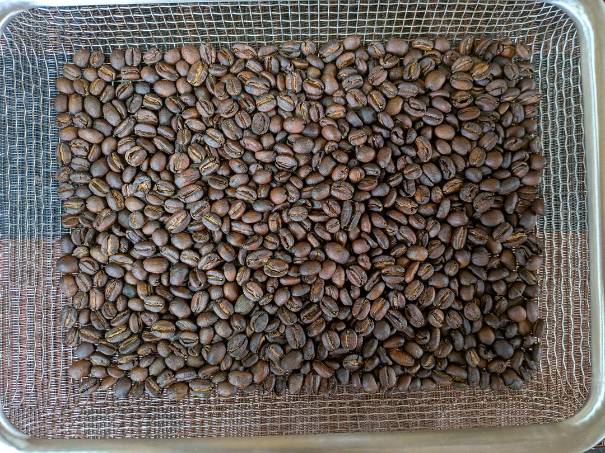
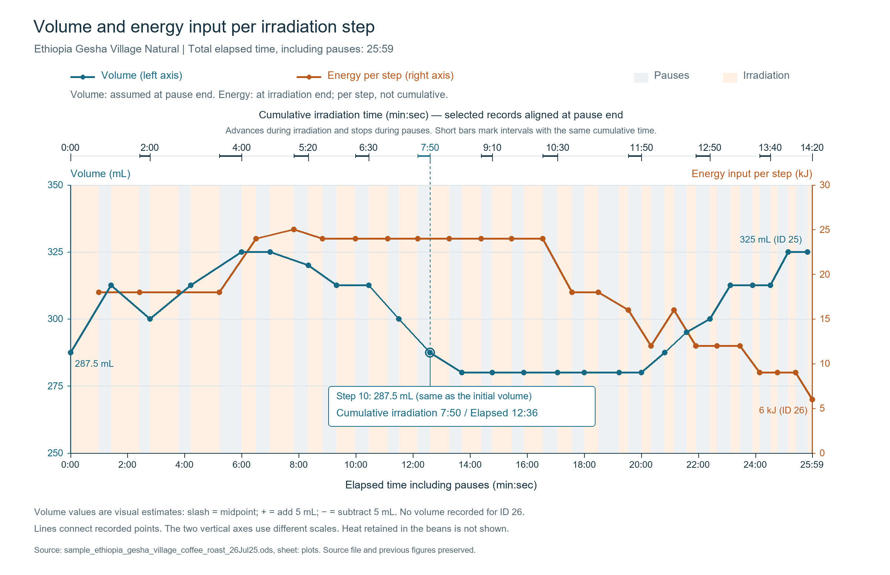

# Roasting Practice: Standard Process Guide

## Prerequisites (Step 0)

All microwave power settings and exposure durations specified in this guide are calibrated based on **144g of dry green coffee beans that have been washed and soaked for 30 minutes in a 50°C warm honey-fructose solution, reaching an initial batch weight of 180g to 190g**.

> **Note**  
> If you choose to roast dry green beans without the pre-washing and hydration steps, the initial moisture content and thermal mass will differ substantially. The power and duration profiles outlined below must be recalibrated accordingly.

---

## Standard Operating Procedure

### Step 1: Fitting the Lid
Fit the lid onto the heat-resistant borosilicate glass cylinder. This ensures rapid heating while circulating internal steam and convective heat.

### Step 2: Placement on the Pedestal (Chopsticks)
Place the untreated wooden chopsticks across the center of the microwave floor, and stand the glass cylinder vertically on top of them.

---

### Step 3: Initial Uniform Heating (300W Preheating)

To eliminate thermal gradients, use low power (300W) to bring the batch up to just below the boiling point of water (approx. 90°C).

* **Protocol**: 300W × 60s irradiation + 25–30s manual agitation × **4 sets**
* At the end of 4 sets, outer container temperature reaches approximately 90°C, and water vaporization reduces total weight by roughly 2.5g to 3.0g.

| Set | Power | Duration | Agitation Interval | Target Temp |
| :---: | :---: | :---: | :---: | :---: |
| 1 | 300W | 60s | 25–30s | - |
| 2 | 300W | 60s | 25–30s | - |
| 3 | 300W | 60s | 25–30s | - |
| 4 | 300W | 60s | 25–30s | Outer wall ~90°C |

---

### Step 4: Primary Heating (High + Medium Power Cycling)

Drive off free moisture and accelerate the rate of temperature rise by alternating between 800W and medium power.  
Never apply 800W continuously across consecutive sets, as this will scorch the beans.

**Crucial Operation**: Starting from this step, **briefly burp the lid (open and close within 1 second) during each agitation interval** to vent excessive steam before returning the container to the microwave.

#### Pattern A: Natural Process (Target: Light to Medium-Light Roast)
Naturals absorb heat rapidly; combine 800W with 600W.

| Set | Power | Duration | Agitation Interval |
| :---: | :---: | :---: | :---: |
| 5 | 800W | 30s | 25–30s |
| 6 | 600W | 40s | 25–30s |
| 7 | 800W | 30s | 25–30s |
| 8 | 600W | 40s | 25–30s |

#### Pattern B: Natural Process Standard (Target: Medium Roast)
Accumulates slightly more thermal energy.

| Set | Power | Duration | Agitation Interval |
| :---: | :---: | :---: | :---: |
| 5 | 800W | 30s | 25–30s |
| 6 | 500W | 50s | 25–30s |
| 7 | 800W | 30s | 25–30s |
| 8 | 600W | 40s | 25–30s |

#### Pattern C: Washed Process (Target: Medium-Dark to City Roast)
Washed lots carry higher water mass; use 500W × 50s to build substantial thermal momentum.

| Set | Power | Duration | Agitation Interval |
| :---: | :---: | :---: | :---: |
| 5 | 800W | 30s | 25–30s |
| 6 | 500W | 50s | 25–30s |
| 7 | 800W | 30s | 25–30s |
| 8 | 500W | 50s | 25–30s |

---

### Step 5: Steady-State Heating (Crack Preparation via Medium Power)

As soon as bean surfaces begin showing light yellowing or browning, discontinue 800W bursts to prevent localized charring. Rely on medium power (500W or 600W) to distribute heat deeply and evenly.

* **Washed / Darker targets**: Apply 500W × 50s for 2–3 sets, then transition to 600W × 40s.
* **Natural / Lighter targets**: Apply 600W × 40s continuously for 3–6 sets.

Toward the latter half of this phase, bean shrinkage will halt, reaching the critical **turning point** where volume begins expanding again.

---

### Step 6: First Crack Induction Boost (*Apply as Needed*)

If volumetric expansion (turning point) has not clearly manifested by the end of Step 5, apply 1 to 2 additional sets of "600W × 30–40s" to reliably drive the batch into the crack development threshold.

---

### Step 7: Accelerating First Crack (Short High-Power Pulses)

To ensure first crack proceeds vigorously without stalling, alternate short bursts of 800W and 600W.

| Power | Duration | Agitation Interval | Evaluation & Action Threshold |
| :---: | :---: | :---: | :--- |
| **800W** | 20s | 25–30s | Accelerate temperature rise |
| **600W** | 20s | 25–30s | Maintain temperature; monitor for onset of first crack |
| **800W** | 20s | 25–30s | Apply only if crack intensity is weak. Skip if strong popping is underway |
| **600W** | 20s | 25–30s | Peak first crack expansion |

---

### Step 8: Finishing and Roast Termination

Once first crack tapers off, fine-tune the roast toward your target development level using incremental bursts of "600W × 15s."

* **Medium-Light (Cinnamon to Medium)**: Terminate around the end of first crack (before any hint of second crack).
* **Medium (High Roast)**: Add 1 to 2 short sets following the conclusion of first crack.
* **Medium-Dark to Dark (City to Full City)**: Terminate immediately upon hearing the sharp, rapid snaps of second crack, or at its peak.

---

### Step 9: Discharge and Rapid Cooling

1. Immediately discharge the beans into a cooling tray or stainless colander upon stopping.
2. Measure the bean surface temperature using an infrared thermometer.
3. Apply forced ambient air (using a blower, fan, or hair dryer on cold setting) to cool the batch down to roughly 30°C within 2 minutes.

| Target Roast Level | Discharge Temp Guideline | Visual & Physical Characteristics |
| :---: | :---: | :--- |
| **Medium-Light** | ~205°C | Light cinnamon color, surface creases present |
| **Medium** | ~215°C | Chestnut brown, creases smoothing out |
| **Medium-Dark** | ~225°C–229°C | Deep dark brown, light oil emergence on surface |

---

## Volume Dynamics and Power Profile Example

