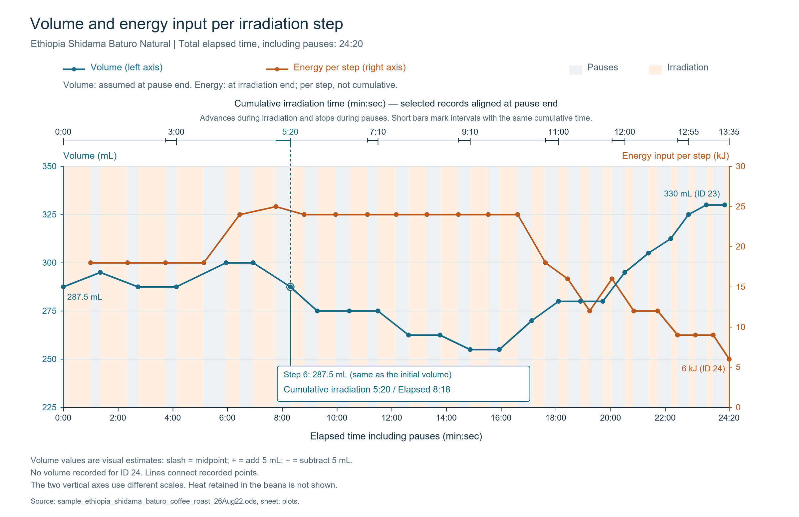

# Roasting Case Study: Ethiopia (Natural / Medium-Light Roast)

This document is an empirical log recording the roasting of an Ethiopian dry-processed (natural) green coffee to a medium-light roast, executed in accordance with the [Standard Process Guide](./microwave_roasting_practice_en.md).

* **Roast Date**: August 22, 2026

---

## Batch Specifications (Step 0)

| Parameter | Set / Measured Value | Notes |
| :--- | :--- | :--- |
| **Coffee Origin / Lot** | Ethiopia Sidama Baturo (2024/2025) | - |
| **Variety** | 74158 | - |
| **Processing Method** | Natural (Dry Process) | - |
| **Input Green Bean Weight** | 144.0g | Standard unit (1kg bag divided into 7 batches) |
| **Washing Water Temp** | 50°C (Purified water) | Chaff and floater culling |
| **Soaking Solution** | 50°C water + 15g honey + 20g fructose | 30-minute soak |
| **Post-Soak Bean Weight** | 183.3g | Measured after removing 2.0g of defective floaters |
| **Initial Bean Temp** | 30.2°C | Infrared reading immediately before roasting |
| **Initial Bed Volume** | 275ml | Visual cylinder reading |
| **Total Weight (incl. container)** | 452.3g | - |

> **Profile Projection**  
> With a post-soak weight of 183.3g (low 180g range), this lot exhibits high cell density and relatively low water absorption. Thermal transmission is anticipated to be rapid, meaning roast progression will likely accelerate. Care must be taken to avoid excessive thermal input leading to over-roasting.  
> Furthermore, this variety frequently displays a rate-of-rise deceleration following the onset of first crack; adequate thermal momentum must be preserved when entering first crack.

---

## Detailed Roasting Operations

### Steps 1–2: Setup
Attach the lid to the container and position the cylinder vertically on top of the wooden chopsticks centered on the microwave floor.

### Step 3: Initial Uniform Preheating (300W)

| No. | Power | Exposure | Agitation Interval | Volume Trend | Operational Notes |
| :---: | :---: | :---: | :---: | :---: | :--- |
| 1 | 300W | 60s | 21s | 275ml | Preheating initiated |
| 2 | 300W | 60s | 23s | 300ml- | Slight volume increase from vaporizing internal moisture |
| 3 | 300W | 60s | 24s | 275ml | Minor packing fluctuation during agitation |
| 4 | 300W | 60s | 49s | 275ml | Interval extended for intermediate weighing |

* **Step 3 Cumulative Heat Input**: 72k Ws (300W × 60s × 4 sets)
* **Step 4 Pre-check Metrics**: Outer wall temp 91.7°C / Total weight 449.2g (Moisture loss: 3.1g)
* **Assessment**: Exceeding 91°C with >3.0g of moisture evaporated by Set 4 confirms highly efficient heat absorption. A fast profile terminating around 24 total steps was selected.

---

### Step 4: Primary Heating (High + Medium Alternating)
Accelerate moisture evaporation. The lid is burped (opened and snapped shut for <1s) during each agitation interval.

| No. | Power | Exposure | Agitation Interval | Volume Trend | Operational Notes |
| :---: | :---: | :---: | :---: | :---: | :--- |
| 5 | 800W | 30s | 29s | 300ml | Rapid temperature rise |
| 6 | 500W | 50s | 32s | 300ml | Thermal energy accumulation |
| 7 | 800W | 30s | 29s | 275–300ml | Shrinkage begins as moisture vents |
| 8 | 600W | 40s | 30s | 275ml | Initial light-tan coloring observed. 800W discontinued |

* **Step 4 Interval Heat**: 97k Ws / **Cumulative Total**: 169k Ws

---

### Step 5: Steady-State Heating (Uniform Conduction via Medium Power)
To prevent premature scorching of natural sugars, 500W × 50s was bypassed in favor of 600W × 40s as the standard cycle.

| No. | Power | Exposure | Agitation Interval | Volume Trend | Operational Notes |
| :---: | :---: | :---: | :---: | :---: | :--- |
| 9 | 600W | 40s | 23s | 275ml | Progressive drying |
| 10 | 600W | 40s | 27s | 250–275ml | Coloring advances (mottled yellow-brown) |
| 11 | 600W | 40s | 29s | 250–275ml | Transition from yellow to pale brown |
| 12 | 600W | 40s | 26s | 250ml+ | Maximum shrinkage phase |
| 13 | 600W | 40s | 24s | 250ml+ | Isolated, faint preliminary snap |
| 14 | 600W | 40s | 31s | 275ml- | **Re-expansion turning point confirmed** |

* **Step 5 Interval Heat**: 144k Ws / **Cumulative Total**: 313k Ws

---

### Step 6: Thermal Adjustment Prior to First Crack
An additional set of 600W × 30s was introduced to prevent stalling upon entering first crack.

| No. | Power | Exposure | Agitation Interval | Volume Trend | Operational Notes |
| :---: | :---: | :---: | :---: | :---: | :--- |
| 15 | 600W | 30s | 29s | 275ml+ | Steady pre-crack expansion confirmed |

* **Step 6 Interval Heat**: 18k Ws / **Cumulative Total**: 331k Ws

---

### Step 7: Driving First Crack (800W Boost)

| No. | Power | Exposure | Agitation Interval | Volume Trend | Operational Notes |
| :---: | :---: | :---: | :---: | :---: | :--- |
| 16 | 800W | 20s | 28s | 275ml+ | Quiet |
| 17 | 600W | 20s | 29s | 275ml+ | Latent heat absorption |
| 18 | 800W | 20s | 32s | 300ml- | **First crack commences (audible pops, expansion)** |
| 19 | 600W | 20s | 29s | 300ml+ | First crack fully develops |

* Because first crack developed with strong momentum, 800W bursts were terminated to prevent overshoot.
* **Step 7 Interval Heat**: 56k Ws / **Cumulative Total**: 387k Ws

---

### Step 8: Finishing & Termination Evaluation

| No. | Power | Exposure | Agitation Interval | Volume Trend | Operational Notes |
| :---: | :---: | :---: | :---: | :---: | :--- |
| 20 | 600W | 20s | 29s | 300–325ml | First crack tapers off |
| 21 | 600W | 15s | 24s | 325ml | Calibration phase |
| 22 | 600W | 15s | 24s | 325ml+ | Crease smoothing progressing well |
| 23 | 600W | 15s | 25s | 325ml+ | Subtle indicators of second crack approaching |
| 24 | 600W | 10s | 25s | - | **Roast terminated** (Target: Medium-Light) |

* **Step 8 Interval Heat**: 45k Ws / **Cumulative Total**: 432k Ws

---

### Step 9: Discharge and Rapid Cooling
Discharged immediately onto the cooling tray; measured bean temperature and commenced forced air cooling.

* **Discharge Bean Temperature**: **215.0°C**
* **Total Post-Roast Weight**: 119.2g (Net yield after 1.2g defect culling: **118.0g**)

---

## Roast Summary

| Evaluation Metric | Measured Value |
| :--- | :--- |
| **Total Steps** | 24 steps |
| **Net Microwave Exposure Time** | 13 min 35 sec |
| **Total Elapsed Time (incl. agitation)** | 24 min 20 sec |
| **Discharge Bean Temperature** | 215.0°C |
| **Finished Bean Weight** | 119.2g (82.8% of dry green weight) |
| **Total Cumulative Energy** | 432k Ws |
| **Time-Normalized Equivalent Energy** | 1065.21 kW/h |

---

## Technical Analysis

Completing in 24 steps with a cumulative energy input of 432k Ws and a final drop temperature of 215.0°C exemplifies the ideal profile for an Ethiopian natural medium-light roast (retaining vibrant floral volatiles while avoiding astringent underdeveloped notes or excessive bitterness).

The time-normalized energy metric of 1065.21 kW/h demonstrates exceptional agreement with the empirical baseline benchmark (approx. 1,060 kW/h) established for 144g pre-hydrated green coffee batches.
